# m8 :chart_with_upwards_trend:
  

<h2 align="center"> - Sobre </h2>
 

A tarefa do aplicativo e transformar a vida financeira das pessoas para melhor.
E para isso acontecer, nada é mais importante do que a educação. 
Pensando nisso, criaremos um app de educação financeira, que é chamado carinhosamente de M8!
Sabemos que a forma como consumimos um conteúdo é tão importante quanto o conteúdo em si.
Por isso, desenvolveremos um aplicativo pensando em quem quer se dedicar às suas finanças, 
mas precisa daquele impulso inicial e de uma melhor organização dos temas.

 
 
<h2 align="center"> - Funcionalidades </h2>
 

 - Login de usuários

 - Conteúdos sobre finanças

 - Lições

 

<h2 align="center"> - Vídeo de Apresentação </h2>
 

 

<h2 align="center"> - Vídeo Propaganda </h2>
 

 Em desenvolvimento :warning:

 

<h2 align="center"> - Fluxograma </h2>
 

  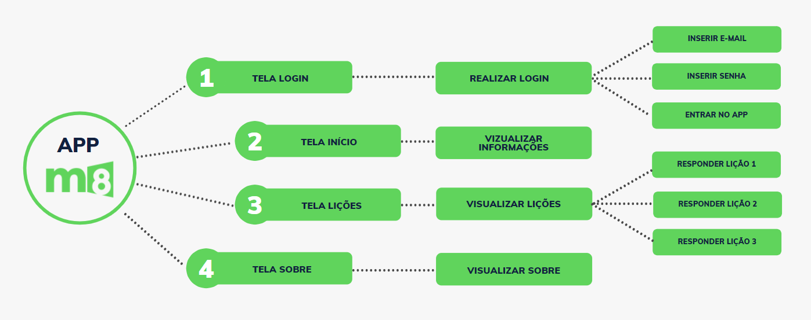

 

<h2 align="center"> - Update </h2>
 

 Projeto sofrerá atualizações ao decorrer do desenvolvimento.

 

<h2 align="center"> - Logo </h2>
  

    

<h2 align="center"> - Interface</h2>
  

  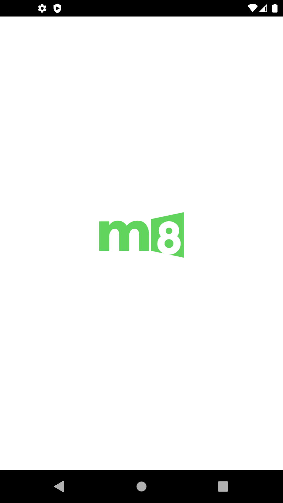
  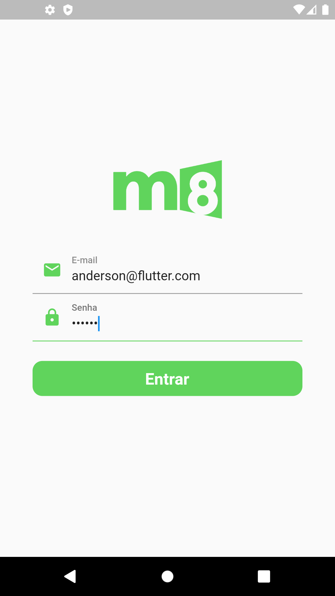
  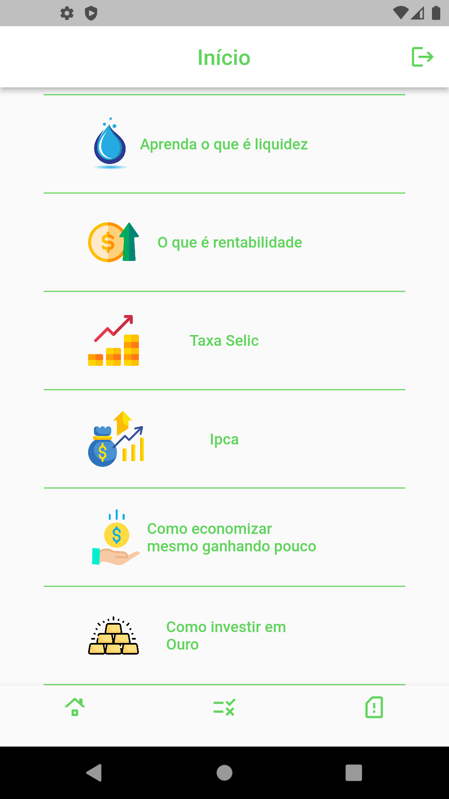
  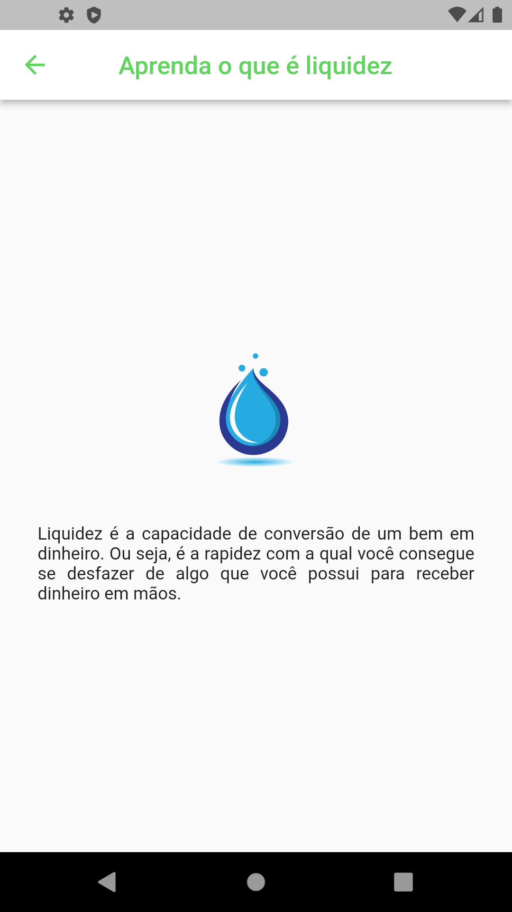
  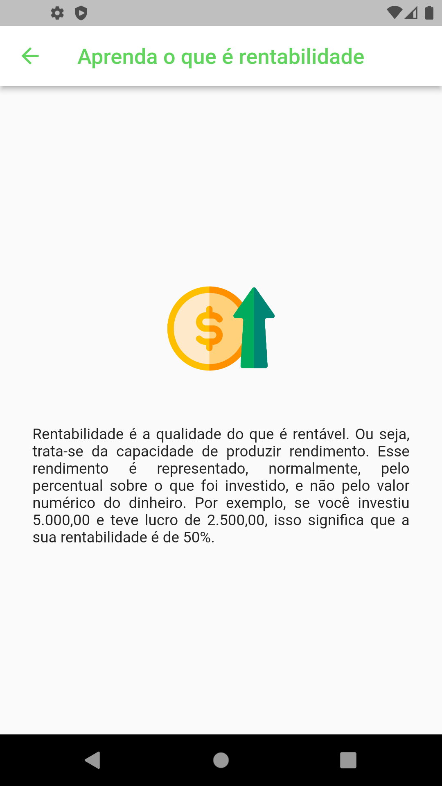
  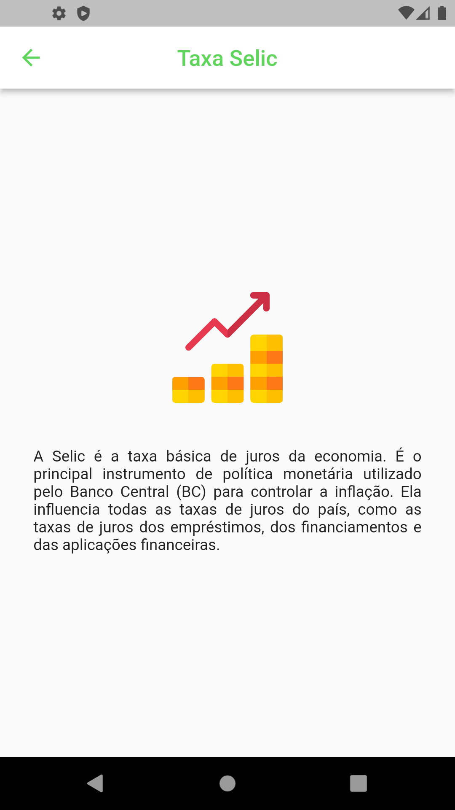
  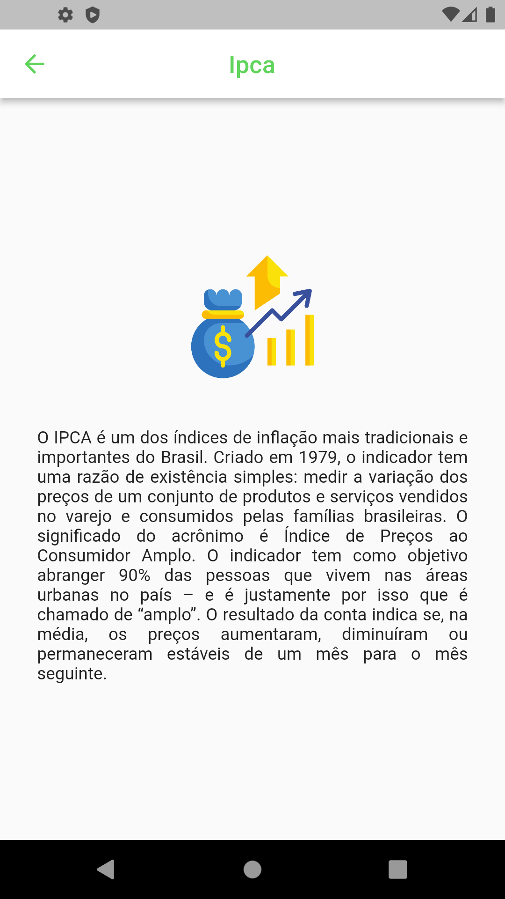
  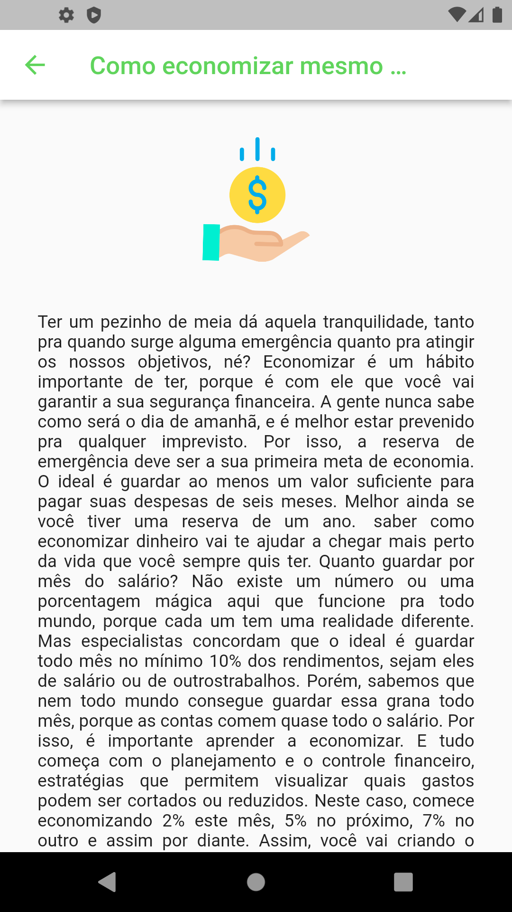
  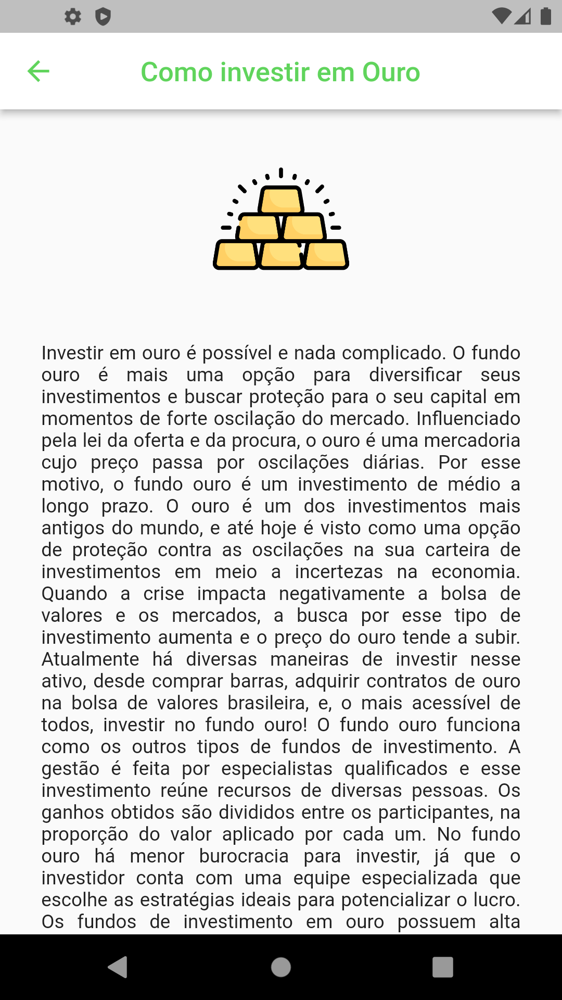
  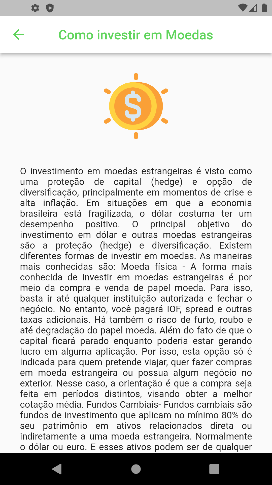
 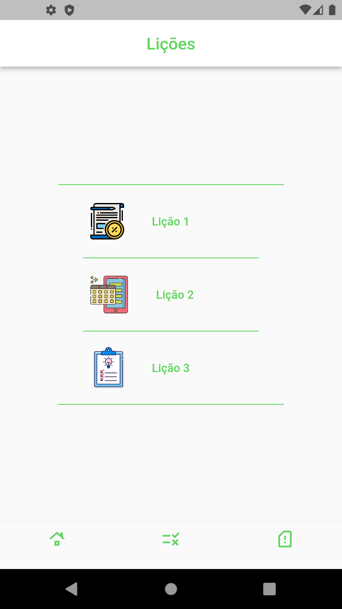
 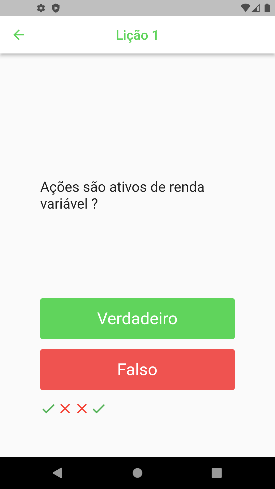
 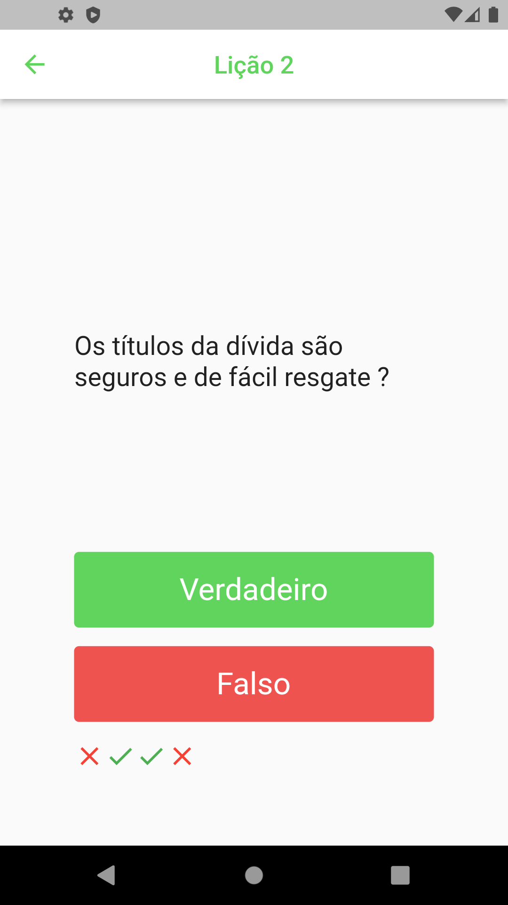
 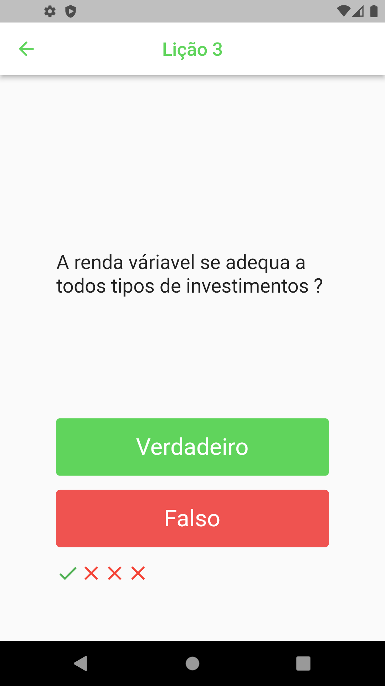
 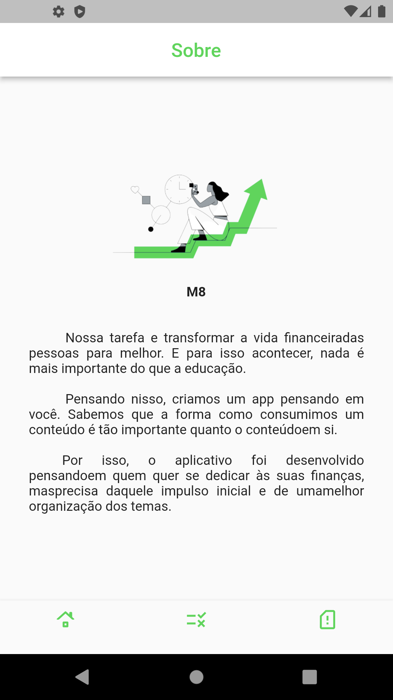
 

 

<h2 align="center"> - Navegação</h2>
  

  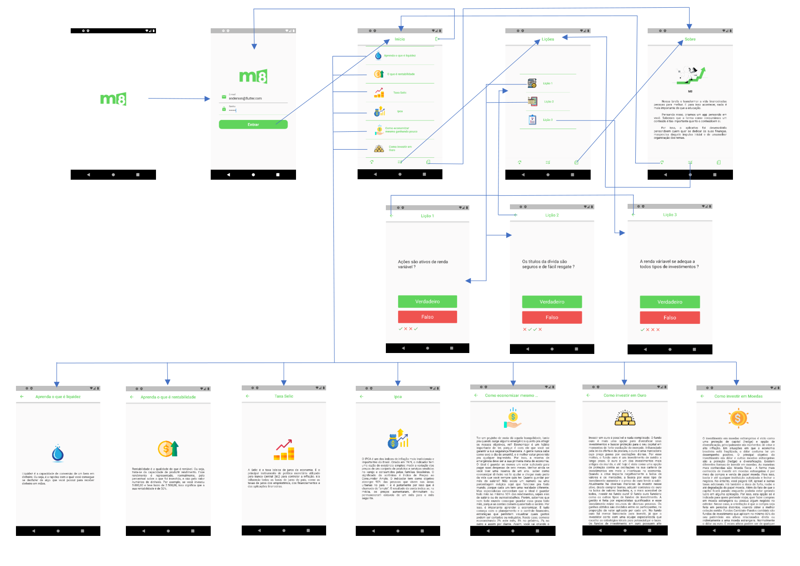

 
